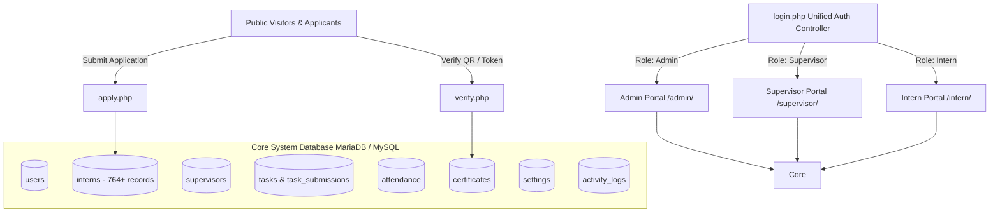

# 🎓 AWT Intern Management System (AWT-IMS)

[](https://www.php.net/)
[](https://mariadb.org/)
[](https://getbootstrap.com/)
[](https://www.iis.net/)
[](LICENSE)

> **A modern, full-lifecycle Enterprise Internship Management Web Application developed for Alamgir Welfare Trust Int'l (AWT).**  
> Engineered to replace legacy Microsoft Access databases (`.accdb`), digitize institutional workflows, and seamlessly manage hundreds of student internships across Pakistan's leading universities.

---

## 📌 Table of Contents

- [Overview & Background](#-overview--background)
- [Key System Highlights](#-key-system-highlights)
- [System Architecture](#-system-architecture)
- [Role-Based Feature Matrix](#-role-based-feature-matrix)
  - [👑 Administrator Portal](#-administrator-portal)
  - [🧑‍🏫 Supervisor / Mentor Portal](#-supervisor--mentor-portal)
  - [🎓 Intern Self-Service Portal](#-intern-self-service-portal)
  - [🌐 Public & Verification Portals](#-public--verification-portals)
- [Technology Stack](#-technology-stack)
- [Directory Structure](#-directory-structure)
- [Installation & Local Setup](#-installation--local-setup)
  - [Prerequisites](#prerequisites)
  - [Step-by-Step Setup](#step-by-step-setup)
  - [Database Configuration](#database-configuration)
- [Default Demo Credentials](#-default-demo-credentials)
- [Production Deployment Guide](#-production-deployment-guide)
- [Security Engineering](#-security-engineering)
- [GitHub Upload & Security Notice](#-github-upload--security-notice)
- [License & Acknowledgments](#-license--acknowledgments)

---

## 📖 Overview & Background

**Alamgir Welfare Trust Int'l (AWT)** is one of Pakistan’s largest non-governmental humanitarian organizations. Every year, AWT hosts undergraduate and postgraduate students from top institutions (such as IBA, Karachi University, NED, FAST, Dawood UET, and SSUET) for intensive 4–8 week internships across administration, IT, finance, health, and social welfare departments.

Prior to AWT-IMS, records were maintained in disparate Microsoft Access files (`New Internship_be.accdb` and `Certificate Intership.accdb`). **AWT-IMS** modernizes and consolidates this ecosystem into a centralized, high-performance web platform featuring:
- **764+ Historical Student Records** migrated and preserved with complete audit histories.
- **End-to-End Internship Lifecycle**: Public application &rarr; administrative vetting &rarr; acceptance offer letter &rarr; department mentor assignment &rarr; daily attendance & deliverables &rarr; 10-point appraisal evaluation &rarr; digital certificate issuance with QR verification.

---

## ⚡ Key System Highlights

- 🔄 **Legacy Access Database Migration**: Fully automated schema conversion preserving all 60 original attributes (documents, schedules, evaluations, assignments).
- 🔐 **Tri-Level Role-Based Access Control (RBAC)**: Distinct permissions and custom interfaces for Admins, Supervisors/Mentors, and Interns.
- 🖨️ **High-Fidelity Document Generation**: Pixel-perfect printable **Acceptance Offer Letters** and official **Certificates of Internship** (modeled after prestigious university certificates).
- 🔍 **Tamper-Proof QR Verification**: Public portal allowing universities, recruiters, and employers to verify credentials via unique cryptographic tokens or certificate IDs.
- 📊 **10-Point Performance Appraisal Engine**: Rigorous multi-criteria grading (Punctuality, Regularity, Productivity, Teamwork, Initiative, Maturity, Confidence, Analytical Ability, Dedication, Subject Knowledge).
- 📈 **Institutional Analytics & One-Click CSV Export**: Instant export of university rosters, confirmed lists, and completion scorecards.

---

## 🏛 System Architecture



---

## 🚀 Role-Based Feature Matrix

### 👑 Administrator Portal
- **Interactive KPI Dashboard**: Real-time counters for Total Registered Interns, Active Placements, Pending Applications, Confirmed Trainees, and Issued Certificates.
- **Roster Management (`interns.php`)**: Filter 764+ records by Academic Year, University/Institute, Approval Status (`Pending`, `Confirmed`, `Waiting`, `Active`, `Completed`, `Terminated`), and search by Student Name, ERP No, or Email.
- **Student Profile 360° (`intern_view.php`)**: Comprehensive view of student biodata, document compliance checklist, attendance charts, assigned tasks, and supervisor evaluations.
- **Application Approvals (`applications.php`)**: Review public submissions, inspect submitted CVs, approve or reject applications with automatic student record creation.
- **Printable Acceptance Offer Letter (`offer_letter.php`)**: Formats official letterhead acceptance notices with custom dates, department allocation, and HR signatory.
- **Printable Certificate of Internship (`certificate.php`)**: High-fidelity completion certificate with auto-generated certificate serial numbers, QR verification codes, and honors period details.
- **10-Point Appraisal Management (`appraisal.php`)**: Input and track performance scores across 10 evaluation benchmarks with automatic cumulative score calculations.
- **Daily Attendance Console (`attendance.php`)**: Organization-wide attendance sheet with filtering by date and department.
- **Reports & Data Export (`reports.php`)**: Generate custom university breakdowns and download complete Excel/CSV data dumps.
- **Global Settings (`settings.php`)**: Manage signatory coordinator names, titles, organization defaults, and active sessions.

### 🧑‍🏫 Supervisor / Mentor Portal
- **Department Roster (`interns.php`)**: Overview of students assigned directly to the supervisor's department.
- **Task Delegation & Grading (`tasks.php`)**:
  - Create project assignments with urgency levels (`Low`, `Medium`, `High`, `Urgent`) and due dates.
  - Review submitted intern deliverables and provide structured revision requests or approval marks.
- **Daily Attendance Marking (`attendance.php`)**: Mark interns `Present`, `Absent`, `Late`, or `Leave` with daily time logs.
- **Evaluation Evaluation (`appraisal.php`)**: Rate interns under their direct supervision on the standardized 10-point scale prior to certificate clearance.

### 🎓 Intern Self-Service Portal
- **Personalized Dashboard (`index.php`)**: Real-time tracker showing internship dates, assigned mentor, department, and overall progress.
- **Document Checklist Tracker**: Visual status indicators for the 6 mandatory onboarding credentials:
  - `Request Form` | `Photograph` | `Curriculum Vitae (CV)` | `Recommendation Letter` | `CNIC Copy` | `Student ID Card`
- **Task Submissions (`tasks.php`)**: View assigned deliverables, download project briefs, upload completed work, and view supervisor feedback.
- **Attendance Log (`attendance.php`)**: Self-audit attendance logs and verify total presence percentages.
- **Document Self-Service**: Direct access to view and print official Offer Letter and Completion Certificate.

### 🌐 Public & Verification Portals
- **Landing Portal (`index.php`)**: Public institutional landing page with live internship counters and direct portal links.
- **Online Application Form (`apply.php`)**: Prospective student portal with CSRF protection, file upload validation for CVs/resumes, and institution selections.
- **Certificate Verification (`verify.php`)**:
  - Live lookup by **Certificate Serial Number** or **Cryptographic QR Token**.
  - Direct fallback verification against 764+ authentic legacy records.
  - Displays student name, father's name, university, degree, completed internship duration, and verification badge.

---

## 💻 Technology Stack

| Layer | Technologies Used | Details |
| :--- | :--- | :--- |
| **Backend** | PHP 8.1+ (FastCGI / Apache mod_php) | Pure Vanilla PHP with clean modular architecture, strictly separated routing, and no bulky external vendor bloat. |
| **Database** | MariaDB 10.4+ / MySQL 8.0+ | Relational schema with foreign keys, stored generated columns, indexes, and full UTF8mb4 encoding. |
| **Data Access** | PHP PDO (PHP Data Objects) | Singleton connection wrapper with prepared statements for 100% protection against SQL Injection. |
| **Frontend** | Bootstrap 5.3.3, HTML5, CSS3, JS | Modern UI with responsive cards, micro-animations, glassmorphism, modal forms, and print media styling (`@media print`). |
| **Iconography** | FontAwesome 6.5.1 (Free CDN) | Comprehensive iconography across all modules and status badges. |
| **Web Servers** | Microsoft IIS 10.0 / Apache 2.4+ | Pre-configured with `web.config` and `.htaccess` for security filtering, file download protection, and URL rewrites. |
| **Migration** | PowerShell 5.1+ / Access OLEDB | Automated conversion scripts from Microsoft Access `.accdb` tables into clean SQL inserts. |

---

## 📁 Directory Structure

```text
AWT-Internship-Management/
├── .htaccess                      # Apache / Plesk security rules and rewrite protection
├── web.config                     # IIS configuration: URL rewrites, MIME types, file hiding
├── index.php                      # Public portal landing page
├── login.php                      # Unified multi-role authentication controller
├── logout.php                     # Secure session termination script
├── apply.php                      # Public student online application form
├── verify.php                     # Public QR code & token certificate verification
├── DEPLOYMENT_GUIDE.md            # Production deployment & operations documentation
│
├── admin/                         # 👑 Administrator Portal
│   ├── index.php                  # Admin dashboard with KPIs and quick links
│   ├── interns.php                # Master intern list with multi-parameter filters
│   ├── intern_view.php            # 360° comprehensive student profile & records
│   ├── intern_add.php             # New intern registration form
│   ├── intern_edit.php            # Intern profile updater
│   ├── intern_delete.php          # Intern removal handler
│   ├── applications.php           # Online applicant review & approval workflow
│   ├── supervisors.php            # Department supervisor management
│   ├── tasks.php                  # System-wide task monitoring & assignment
│   ├── attendance.php             # Organization attendance register
│   ├── appraisal.php              # 10-benchmark performance appraisal evaluator
│   ├── offer_letter.php           # High-fidelity printable acceptance letter
│   ├── certificate.php            # High-fidelity printable completion certificate
│   ├── reports.php                # University roster reports & CSV export
│   └── settings.php               # System parameters & signatory configuration
│
├── supervisor/                    # 🧑‍🏫 Supervisor / Mentor Portal
│   ├── index.php                  # Department mentor dashboard
│   ├── interns.php                # Roster of interns assigned to this supervisor
│   ├── tasks.php                  # Task assignment, submission review, and grading
│   ├── attendance.php             # Daily department attendance marking
│   └── appraisal.php              # Trainee performance evaluation
│
├── intern/                        # 🎓 Intern Self-Service Portal
│   ├── index.php                  # Intern overview, onboarding checklist & progress
│   ├── profile.php                # Student bio & contact updater
│   ├── tasks.php                  # Deliverable viewer and file submission portal
│   ├── attendance.php             # Personal attendance history
│   ├── offer_letter.php           # Shortcut to printable offer letter
│   └── certificate.php            # Shortcut to printable completion certificate
│
├── config/                        # ⚙️ Core Configuration & Security
│   ├── database.php               # PDO singleton database connection with multi-env fallback
│   ├── auth.php                   # RBAC session security, permission guards, password hashing
│   └── helpers.php                # Global utilities: sanitization, CSRF tokens, flash alerts
│
├── includes/                      # 🧩 Reusable Layout Components
│   ├── header.php                 # Top navigation bar, session user display, mobile toggle
│   ├── sidebar.php                # Dynamic role-based sidebar navigation
│   └── footer.php                 # Page footer and core script tags
│
├── database/                      # 🗄️ Database Schemas & Migrations
│   ├── schema.sql                 # Clean 9-table MariaDB/MySQL database schema
│   ├── seed_data.sql              # Default administrative users and initial settings
│   ├── awt_internship_full.sql    # Complete SQL dump including schema + 764 authentic records
│   ├── migrate_access_data.sql    # Initial 700 student record migration script
│   ├── migrate_certificate_data.sql # Incremental 64 student & certificate ledger migration
│   ├── export_from_access.ps1     # PowerShell script extracting data from MS Access
│   └── import_certificate_data.ps1# PowerShell script extracting certificate data
│
└── assets/                        # 🎨 Static Assets & Media
    ├── css/
    │   ├── style.css              # Main application styling, cards, tables, dashboard themes
    │   └── certificate.css        # High-fidelity printable certificate and letter styling
    ├── js/
    │   └── main.js                # Core JS: auto-dismiss alerts, confirmation dialogs, forms
    ├── images/
    │   ├── awt-logo.png           # Official Alamgir Welfare Trust emblem
    │   └── default-avatar.png     # Fallback profile picture
    └── uploads/                   # User document and CV uploads (secured via .gitkeep)
```

---

## 🛠️ Installation & Local Setup

### Prerequisites
- **Web Server**: Apache 2.4+ / Nginx / IIS or local stack (**XAMPP**, **Laragon**, or **WampServer**)
- **PHP**: Version `8.1` or higher with `pdo_mysql`, `mbstring`, and `gd` extensions enabled
- **Database**: MariaDB `10.4+` or MySQL `8.0+`
- **Git** installed on your system

---

### Step-by-Step Setup

#### 1. Clone the Repository
```bash
git clone https://github.com/your-username/awt-internship-management.git
cd awt-internship-management
```

#### 2. Move to Web Root
- **XAMPP**: Move the project folder to `C:\xampp\htdocs\awt-internship-management`
- **Laragon**: Move to `C:\laragon\www\awt-internship-management`

#### 3. Setup the Database
1. Start **Apache** and **MySQL** in your control panel.
2. Open **phpMyAdmin** (`http://localhost/phpmyadmin`) or your preferred MySQL client (HeidiSQL, DBeaver, MySQL Workbench).
3. Create a new database named `intern` or `awt_internship`:
   ```sql
   CREATE DATABASE `intern` CHARACTER SET utf8mb4 COLLATE utf8mb4_unicode_ci;
   ```
4. Import the schema and data. You have two options:
   - **Option A (Complete Data with 764 Records - Recommended)**:
     Import `database/awt_internship_full.sql`.
   - **Option B (Clean Fresh Setup)**:
     Import `database/schema.sql` followed by `database/seed_data.sql`.

#### 4. Configure Database Connection
Open `config/database.php` and verify your local credentials. The system includes built-in fallback configurations for standard development environments:

```php
// Local Development (XAMPP / Laragon / WAMP)
$configs[] = [
    'host' => '127.0.0.1',
    'port' => '3306',
    'name' => 'intern',
    'user' => 'root',
    'pass' => ''
];
```

You can also specify environment variables if preferred:
```env
DB_HOST=localhost
DB_PORT=3306
DB_NAME=intern
DB_USER=root
DB_PASS=
```

#### 5. Launch the Application
Open your web browser and navigate to:
```text
http://localhost/awt-internship-management/
```

---

## 📜 License & Acknowledgments

- **Developer**: Muhammad Abubakar
- **Organization**: Alamgir Welfare Trust Int'l (AWT)
- **License**: Released under the [MIT License](LICENSE).

---
*Developed with dedication to streamline and empower student internship administration for Alamgir Welfare Trust Int'l.*
